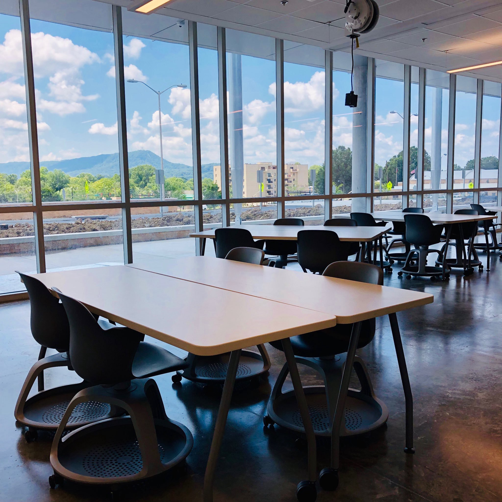
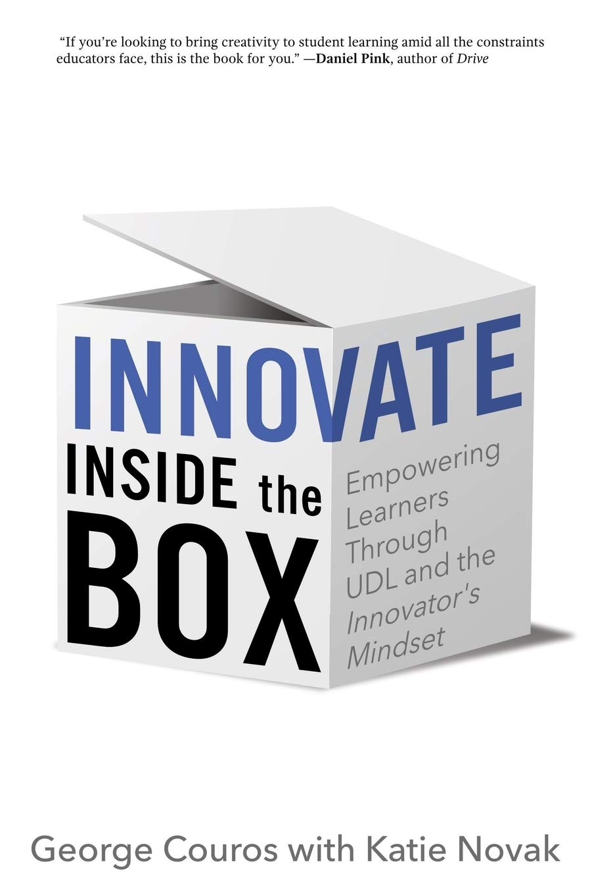

I missed an opportunity today. It was one of those many moments that I reflect on after a day in the classroom. Sometimes I get fixated on following my plan that I miss those moments that arise naturally when your teaching.

> Opportunities are like sunrises. If you wait too long, you miss them. — William Arthur Ward

My new classroom is a pretty amazing place to teach and learn. We have floor to ceiling windows that face a majestic view of the mountains. When the weather changes, the view is dramatic.

Today a storm started rolling in over the mountain, and we had a fantastic lightning show as the storm approached. Needless to say, it caught several of the students' attention. After some quick gawking at the storm, the majority of the students got back to work on the project we are currently working on.

The project required the students to develop a simple command-line game using basic JavaScript syntax, but ultimately we were examining the question of how we could model real-world things in the computer. Students used simple abstractions for cards, dice, and scorecards to create their games. The games were a pretense to discuss data types and how programmers have to think differently when modeling the real world.

So as the storm raged on, a few of the students just couldn’t back on task. I gently reminded them of the due date, and the importance of the question we were addressing through the game. However, it’s hard to compete with a storm for engagement, so for these couple of students, the last twenty minutes of class was a loss.

Here’s where I missed my opportunity. Later, it dawned on me that I should have had everyone shut their computer and watch the storm. They were already distracted. And I would want them to watch it not just because it was cool.

Right there outside the window was an impressive example of the real-world we were trying to model with the computer. I missed the opportunity to ask the students how we could represent a storm in code. What kind of data would we use? What kinds of computation could we do with that data?

These are some of the same problems facing computer scientists modeling weather systems and climate change.

Unfortunately, that moment is gone, and I missed the chance to connect something engaging with what we were learning. I recognize that I need to be more circumspect as I teach. I need to be more sensitive to the students and make my classroom more student-centered.

I can assure you I’m just waiting for the next storm to roll through, and I’ll be better attuned to where my students are so I don’t miss another opportunity.

    

When we empower learners to investigate and make an impact on the world, we inspire problem-solvers and innovators. — Katie Martin, From the Forward of Innovate Inside the Box

<h3 style="text-align: left;">Innovate Inside the Box</h3>

Check out Innovate Inside the Box. It’s what I was reading when I realized the opportunity I missed. I’ve been pretty impressed so far, and I find myself reflecting on my practice.

If you have any tips for recognizing those creative moments, comment below or tweet @dnbailey.
