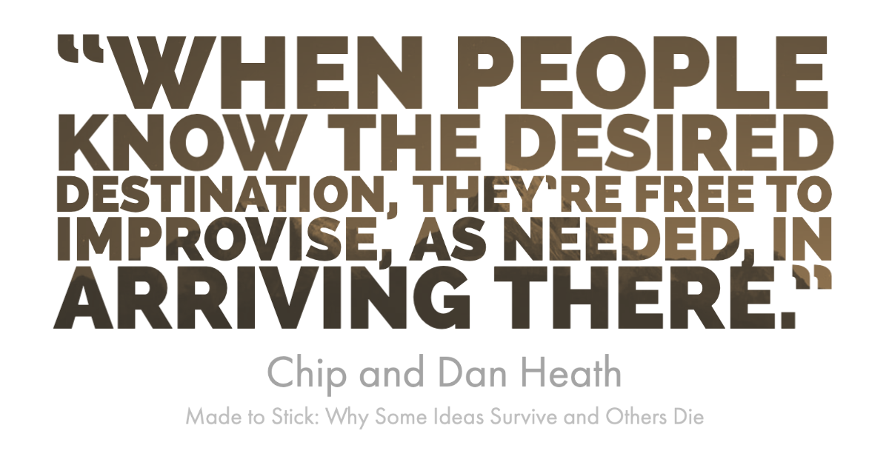
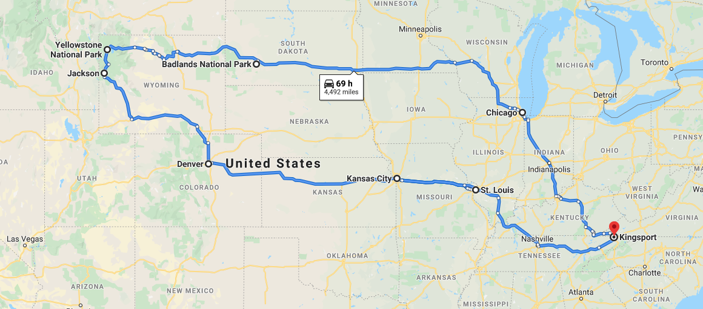
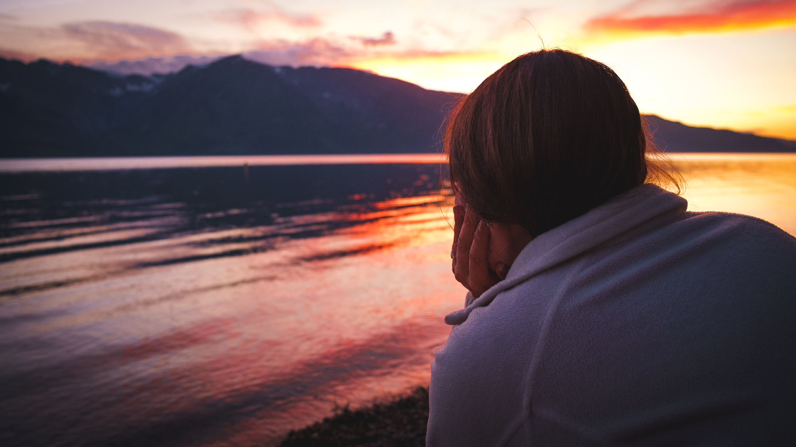

For our honeymoon, my wife and I took a roadtrip out west. Neither of us had been to Yellowstone National Park, and it seemed like the perfect destination for a two-week road trip. We watched videos, looked at photos, and dreamed big. **We created a vision of where we wanted to go.**

It took several weeks to plan out the route and all the stops along the way. We wanted to make the most of our time on the road, but we also wanted to leave time to explore cities along the way. We booked rooms, planned spots to eat, and even scouted a few museums in the larger cities. **We developed a mission that would help us realize our vision.**

---

## New Podast - Contemplating Quotes

I've just launched a new podcast where you can listen to me Contemplating Quotes. The first episode includes a quote from Wiggins and McTighe's book _Schooling by Design_, and I share my thoughts on mission and vision.

 

<iframe src="https://anchor.fm/neverstoplearningwithme/embed/episodes/Mission-and-Vision--Episode-1-ectjf9" height="102px" width="400px" frameborder="0" scrolling="no"></iframe>

---

I have been reading Wiggins and McTighe's _Schooling by Design_ for my graduate class this semester, and I continue to be impressed by the ideas in this book. One of the core tenets of the book is that a school's mission should drive all decisions and processes. This may seem obvious, but the authors posit that too often the mission is vague and not actionable.

The mission of a school should be so ingrained that all stakeholders know it and understand how it drives the school's daily activities - from the classroom to the athletics office. In my experience school mission statments are written and then go to die on office walls and are buried on school websites. They may contain some motivational langauge and may even inspire us to be better educators, but they lack the clear and actionable language necessary to make them meaningful.

## The Destination

A good mission begins with a clear vision. You have to be able to envision where your destination before you can begin planning a route to get there. Too often our vision is vague. Vision that want "all children to succeed" or "equity and justice" are built on valuable ideals, but they don't make it clear what it will look like when we arrive.

When my wife and I were planning our road trip, we looked at maps and images from other people's trips. We even read some guides for what to see and expect when we reached Yellowstone. We knew that even in the Summer months it gets cold at nights. We knew that there was no way to visit all the park in our time there, so we made sure we knew what we wanted to see most. In other words, we established a clear vision for what it would be like when we reached Yellowstone.

While it is noble to desire all students to succeed, we have to get clearer on what that success looks like. If all students are succeessful and we have an equitable system, what should we see as a result. **What do we want are schools to look like is the the question that should drive our vision.** This means looking to other schools that have already made it - examining thier photo albums. We need to know what to expect when we get there - what is the weather going to be like.

The best part about having a vision of our destination is that it empowers staff to make desicions that will move us closer. Leaders can't micromanage and expect to reach the vision. However, if the vision is clear, then the staff is equipped to help move the organization forward. We have to trust that others are along for the journey and trust their work is moving in the right direction.

## The Roadmap

If the vision is our destination, then the mission is the road map to get us there. The drive from our home in Tennessee meant we had about 2000 miles to travel before we reached our destination. We didn't just want to drive straight out and miss all the fun place along the way, so we planned our stopping points strategically. From a night in Chicago to Badlands National Park, we planned each step of the way along our path to Yellowstone.

Lize and I are both planners. Now that we had a clear vision for our destination, we planned how long we'd need to drive each day. We booked hotel rooms and campsites. We purchased gear for camping and clothing for fancy dining. From scoping out restaurants to determining where to park, we mapped out each step in our journey. It all coincided with reaching Yellowstone by our reservation date.

In our organizations, we lack this level of detail in our mission. In an effort to make mission statements memorable and catchy, we sacrifice clarity and actionability. Mission statements don't need to inspire; instead they need to help us reach the destination that inspires our journey. The mission of an organization needs to make it clear how we will reach our destination.

I think that we need to reconsider our mission statements. How are they driving the work of the school? Is it clear to stakeholders what the priorities are that will get us to our destination? Are our priorities student centered? Are the practices we need to get rid of that are hindering our mission? The mission of an organization becomes a central hub for planning and refleciton, and it is critical that these tools are not hidden away on an office wall or buried on the website.

## It's About the Journey

It's easy to get caught up in the planning and never start the journey. However, the journey is where all the fun is. If we plan forever, then we never get to see our destination. Some of our favorite memories from the trip weren't in Yellowstone. 

One of our favorite spots was just south of Yellowstone in Grand Teton National Park. We got to spend sunset on the shore of Jackson Lake watching the sun set behind the majestic mountains. It was something we had not envisioned or planned for, but we treasure the beauty of that moment.

Earlier in our trip, we had planned on watching the Fourth of July fireworks display in Souix Falls, South Dakota. Unfortunately the weather did not cooperate and the evening sky was masked with a drizzly rain. We decided to make the best of it and visit a park in town. We discovered why the area was named Souix Falls as we explored a beautifully lit cascade in the middle of town. We had no idea, and despite our plans being ruined we had a wonderful time.

The point is that mission and vision will not encompass all the successful moments of a school organization. While the mission and vision get us going in the right direction. We have to be aware of the discoveries along the way. You never know what surprises are instore along your journey, but you'll never see them if you don't get going.

---

What is your school's vision and mission? Are these tools really being used well or is it time to reassess your goals? I'd highly recommend checking out Wiggins and McTighe's *Schooling by Design* to all school leaders whether your in the classroom or serivng on the school board.

Share your thoughts with me [@dnbailey](https://twitter.com/dnbailey). I'm also always looking for travel ideas, so let me know where our next destination needs to be.