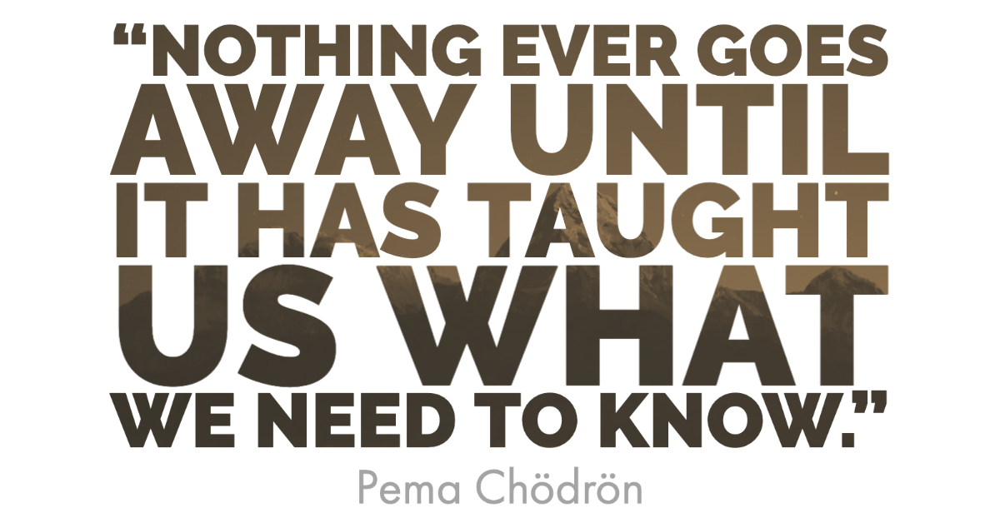

Let me begin by saying that starting remote learning in the middle of a crisis, mid-way through a semester is anxiety-inducing, frustrating, and all the other negative emotions associated with circumstances being out of our control. I feel it - deep down in my soul. **This crisis is not going away anytime soon, so instead of sucumbing to the anxiety I plan on learning as much as I can from this expeirience.**

While many of the posts I have seen online deal with the technical how-to of remote learning, **I've been more interested in what it teaches us about our normal school day**. Here are some of my thoughts and learning from the last couple of weeks.

## Remote Learning is Inherently Lonely...

Teaching and learning remotely is inherently lonely, and it's got me thinking about how many students feel alone during a normal school day. I thrive on the interactions with students and colleagues, but how many students don't miss school right now because they have lost none of that being away.

I remember being lonely in school. There were days that despite talking to other people, I just felt isolated. The recent need to social distance has highlighted this memory for me. As a teacher, I usually see students for an a little over a day, so it's hard to know what their full day's experience is really like. I know there are many that coast through the halls surrounded by hundreds of other students yet completely alone.

Teaching and learning is natural human activity, but how often do we make it a solidary exprience. That is not natural. I have really been thinking about the importance of socializaiton's impact on learning. In a remote environment this is even more apparent. Next week I plan on having just a meet and greet via a virtual conference. I don't plan to deliver a lesson or facillitate support but just socialize with my students.

We need connection during this time of crisis, and we need socialization during the normal school day too. How easy would it be to devote 5 minutes each class period to just socializing. Imagine all those lonely souls wandering the halls having the opporuntity to connect. Sure not everyone would take advantage of it, but at least the chance for human contact is there. **We must cherish and protect opportunities to connect with each other every day.**

## Anxiety is Infectious

I'm not a big consumer of mainstream news outlets, but I'm a huge NPR junkie. I've missed my daily ride to work listening to the latest on Morning edition. Instead each morning I wake up and check the latest statistics on the Covid-19 crisis. Thousands more infecteted - hundreds more dead. Each morning I find myself more and more axious, and I'm not normally an axious person.

This morning was particularly bad. My wife left for school to distribute meals and I was left at home to do my daily office hours. A few emails to the empty room and providing feedback on some of the assignments that had been submited consumed the first few hours. Then I just found myself aimlessly wandering the house. I was pacing for no reason, and honestly I don't even remember getting up from my desk. Racing through my mind were all the things I just had to get done.

https://twitter.com/dnbailey/status/1248267456289943555

After settling back in to my chair, I started searching for anxiety fixes, and I stumbled across Brené Brown's new podcast [Unlocking Us](https://brenebrown.com/podcast/introducing-unlocking-us/). This was exactly what I needed. She nailed me perfectly as having an over-functioning response to anxiety. I know I'm not alone in this. Instead she suggested that we get to chose whether we want to infect others with our axiety or our calm - not a hard choice but one that requires self-awareness.

How often do I infect my students with anxiety during the normal school day? Pressure to perform and achieve as a teacher raise my axiety, and I know I transfer those to my students. We have to be keenly aware of our responses to stress and anxiety, so we can respond in a healthy manner. I love Brené's books for this reason. I feel like she provides a framework to understand yourself and groung yourself in authenticy and integrity.

## Performance vs. Designing Experiences

I have been engaging with the work of Phil Schlechty as part of my graduate program, and I find myself constantly thumbing back through his book [Engaging Students](https://www.amazon.com/Engaging-Students-Phillip-C-Schlechty/dp/0470640081) to find little nuggets of wisdom. One that I ran accross today really struck me as relevant to remote learning. He basically said that we have to shift our instruction from teacher performance to student performance. This necessitate designing engaging student learning experiences that require heuristic student performances.

https://twitter.com/dnbailey/status/1247894525416058881

Remote learning shines a light on many instructional practices that really need to be reformed - my own practice included. How often do we feel on top of our game when we "deliver" the perfect lesson. I see now that it was just my performance that I was basing that on. Really learning should be judged based on the learners performance not the teachers. Too often I fall short of this high bar.

Teaching remotely has only made more aware of the need to focus on designing student learning experiences that are engaging and demand student performance. Not the token compliance we often see in education, but true, empowering achievement only possible through struggle and chance of failure. I'm still figuring out what this looks like in my classroom, but I know that remote learning or in-classroom learning I have much room to grow and learn.

## Never Stop Learning

There are many other things big and little that I learn each day through this crisis. I'd love to learn from you and the takeaways you've had during the transition online. Send me a direct message or Tweet [@dnbailey](https://twitter.com/dnbailey) and let me learn from you too.
